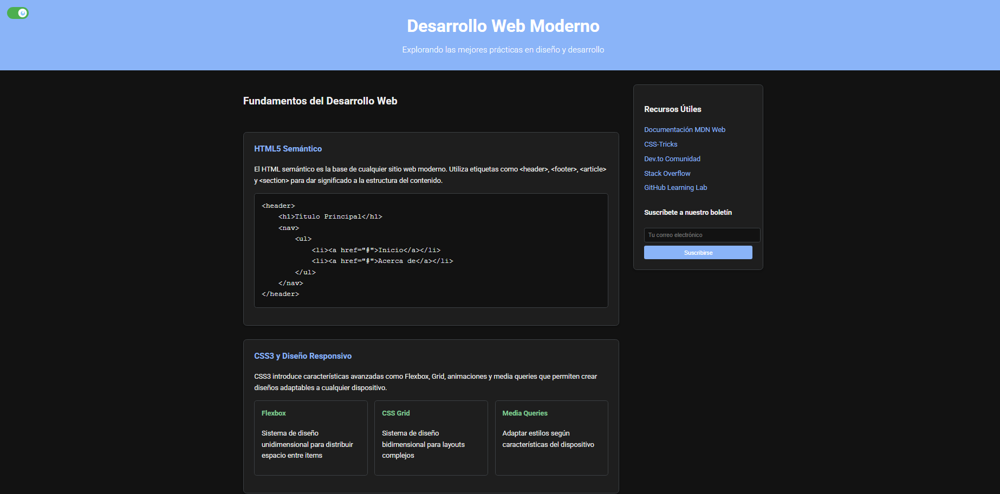
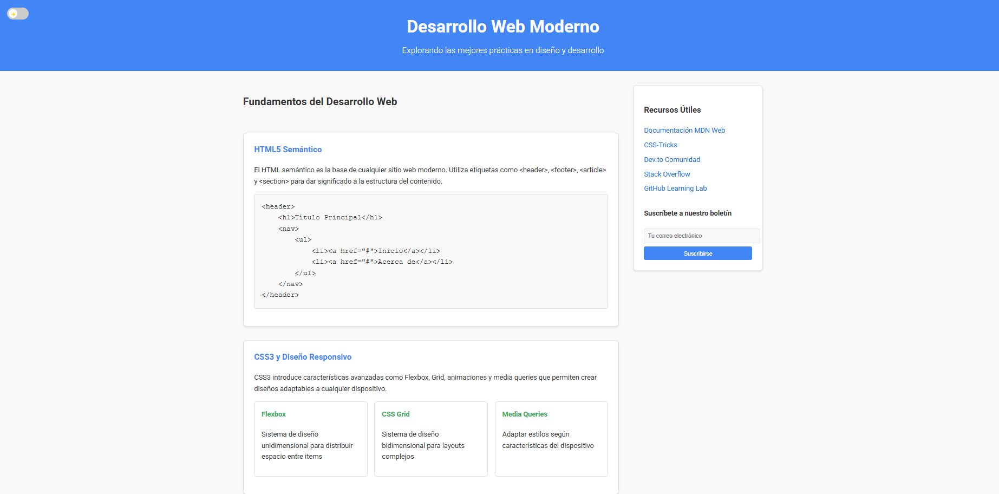
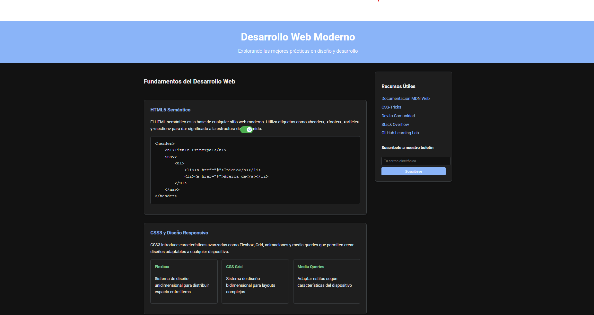

# 🌗 Librería de Modo Oscuro/Claro con Interruptor Flotante

Esta librería proporciona un **interruptor personalizable** para cambiar entre **modo claro y modo oscuro**, con un diseño moderno basado en SVG, estilo `switch` y **posicionamiento flotante y arrastrable en pantalla**.

## ¿QUÉ HACE ESTE COMPONENTE?
- Detecta si el usuario prefiere modo oscuro (mediante `prefers-color-scheme`).  
- Aplica dinámicamente una clase al `<body>` para cambiar los estilos CSS.  
- Cambia automáticamente el ícono del interruptor (🌞/🌙).  
- Guarda la preferencia en `localStorage` para persistencia.  
- **Interruptor arrastrable**: ¡Posiciónalo donde quieras en la pantalla!  
---
📹 **Video demostrativo**: [Ver en Drive](https://drive.google.com/file/d/141aWUZQ1BLxvWrHA-2AJr0bO62pg1KUR/view?usp=sharing)  

## Instalación
Puedes integrarla fácilmente en tu proyecto HTML de la siguiente forma:

### Descarga e incluye manualmente
Guarda los siguientes archivos en tu proyecto:

 - [`css/componente.css`](./css/componente.css)  
- [`js/componente.js`](./js/componente.js)  

Luego, inclúyelos así:

```html
<link rel="stylesheet" href="css/componente.css">
<script src="js/componente.js"></script>
```
## Uso Básico
Agrega el componente donde gustes

```html
<div id="switch-tema" class="switch-container">
  <label class="interruptor">
    <input type="checkbox" />
    <span class="slider">
      <span class="icono-circulo"></span>
    </span>
  </label>
</div>
```
## Métodos y Funcionalidad Interna
```js
(function crearInterruptor(selector, opciones = {}) { ... })('#switch-tema', {
  onToggle: (estado) => console.log('Modo oscuro activo:', estado)
});

```
1. `crearInterruptor(selector, opciones)`
Función autoejecutable que inicializa el interruptor. Recibe:

- `selector:` ID o clase del contenedor (ej. #switch-tema).

- `opciones:` Objeto opcional:

- `iconoClaro:` SVG personalizado para modo claro.

- `iconoOscuro:` SVG personalizado para modo oscuro.

- `onToggle:` Callback al cambiar el modo.

2. `actualizarIcono(estado)`
Actualiza el ícono dentro del botón deslizante (🌞 / 🌙), dependiendo del estado (true para oscuro, false para claro).

3. `toggle.addEventListener('change', ...)`
- Detecta cuando el usuario cambia el interruptor y:

- Agrega o remueve la clase dark-mode al <body>.

- Guarda la preferencia en localStorage.

- Ejecuta el callback onToggle, si se proporcionó.

4. `localStorage.getItem('modoOscuro')`
Lee la preferencia guardada y aplica el modo automáticamente al cargar la página.

5. `window.matchMedia('(prefers-color-scheme: dark)')`
Si no hay preferencia previa, detecta si el usuario tiene el modo oscuro activo en su sistema operativo.

6. Sistema de arrastrar y mover `(mousedown, mousemove, mouseup)`
Permite reposicionar el interruptor en cualquier lugar de la pantalla al arrastrarlo.


## Personalización
Puedes modificar los íconos y el comportamiento fácilmente usando parámetros opcionales:
```js
crearInterruptor('#switch-tema', {
  iconoClaro: '<svg>...</svg>',  // Ícono personalizado para modo claro
  iconoOscuro: '<svg>...</svg>', // Ícono personalizado para modo oscuro
  onToggle: (estado) => {
    console.log('Modo actual:', estado ? 'Oscuro' : 'Claro');
  }
});
```
## Página en modo oscuro

## Página en modo claro

## Componente flotante por toda la página

